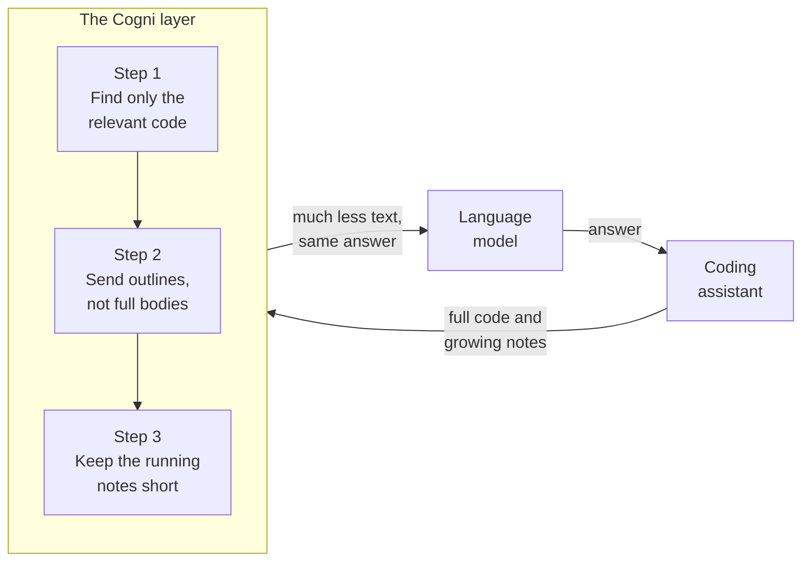

# How Cogni Works

Modern coding assistants, the kind that read your repository and write fixes for you, run on large language models. Every time the assistant thinks, it sends a slice of your code and its own running notes to the model, and you pay for every word it sends. The longer a task runs, the more the assistant piles up: files it has read, search results it has gathered, and the back and forth of its own reasoning. That pile gets sent again on every step, and the bill grows with it.

Cogni is a thin layer that sits between the coding assistant and the model. Its job is simple to state and hard to do well: send the model less, without making the assistant any worse at finishing the job. We do this in three steps, and we measure each step on its own so we always know which part is pulling its weight. The rule we hold ourselves to is strict. A change only counts as a win if the assistant still succeeds just as often. Saving words by giving worse answers is not progress.

Here are the three steps. At a glance, the assistant sends a large and growing amount of context on every step, and Cogni shrinks it in three ways before it reaches the model.

## Step one: find only the code that matters

When an assistant needs to understand part of a codebase, the lazy approach is to hand it whole files, or even whole folders. Most of that text is irrelevant to the task at hand, and all of it costs money to send.

Cogni takes a smarter route. Ahead of time, it reads the repository and splits it into clean, meaningful pieces: a single function here, a method there, the outline of a class somewhere else. It splits along the natural seams of the code rather than chopping at arbitrary line counts, so each piece is something a developer would recognize as a unit. It then turns each piece into a numerical fingerprint that captures its meaning, and stores all of these fingerprints in a small local database.

When a task arrives, Cogni turns the request into the same kind of fingerprint and looks up the handful of code pieces whose meaning sits closest to it. Instead of a whole file, the assistant receives just the few functions that actually relate to the question. On our benchmark this locates the right code for the answer in the large majority of cases, while sending only a small fraction of the text a naive approach would.

## Step two: send outlines, not full bodies

Even the relevant pieces are often longer than they need to be. To judge whether a function matters, the assistant usually only needs to see its name, its inputs and outputs, and a short description of what it does. It rarely needs every line of the body up front.

So the second step sends an outline. The top few results come through in full, because those are the most likely to be needed in detail. The rest arrive as a signature and a one line description, with the body replaced by a clearly marked placeholder. Every outline also carries a label that points back to the exact file and line range it came from. If the assistant decides it does need the full body after all, it can ask for that specific range and get it.

Nothing is ever quietly deleted or scrambled. An outline is always valid, readable code, just shorter. This step trims the size of each result while keeping a clear path back to the detail for the rare moments the detail is genuinely needed.

## Step three: keep the running notes short

The first two steps deal with code coming in. The third deals with the notes piling up. As a task goes on, the assistant builds a history: the searches it ran, the files it read, the conclusions it reached. By default all of this travels with every new message, so a long task re-sends the same growing transcript over and over.

Cogni keeps that history in check. The most recent action and its result are always kept word for word, because that is the freshest and most important context. Older observations are condensed into short summaries that preserve the facts that matter: file paths, names, error messages, and decisions. Two safeguards stop this from backfiring. Cogni only condenses when the history has actually grown past a set size, so short tasks pay nothing at all, and it summarizes each old observation only once rather than redoing the work on every step.

There is a subtle but important detail here. Summarizing is itself work, and work costs tokens. We do that work on a small, cheap model, while the savings land on the larger and more expensive model the assistant runs on. Measured on real recorded sessions, the raw word count comes out roughly even, but the actual cost drops by about a fifth, because we move effort from the expensive model to the cheap one and shrink the expensive context along the way.

## How we keep ourselves honest

It is easy to make a number look good by quietly lowering quality, so we work hard not to. The trick is to always compare against the same fixed work and change only the one thing we are testing. For the first two steps, the set of answers the assistant must find never changes, so any savings cannot have come from simply finding fewer of them. For the third step, we replay real recorded sessions and change only whether the history is compressed, so the final answer is identical by construction and the measured savings are real.

We also report cost in more than one way, including the least flattering way, so anyone reading can see exactly where a gain comes from and where it does not. Each step is published with its own measured result before the next one is built. The point of Cogni is not a single dramatic claim. It is three honest, separate gains that add up to a coding assistant that does the same work for noticeably less money.
