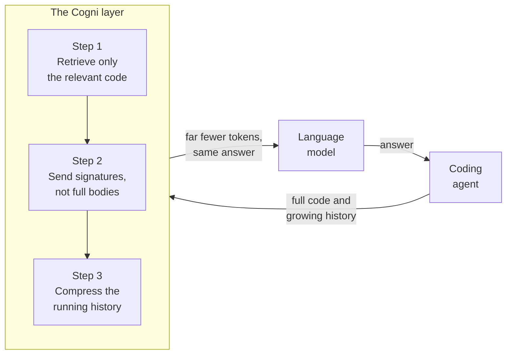

# How Cogni Works

Coding agents spend tokens at a brutal rate. On every step the agent re-sends its working context to the model: the code it has pulled in, the tool outputs it has collected, and the transcript of its own reasoning. That context only grows as a task runs, and you pay for the whole thing on every turn. For a multi-step task, the same code and the same notes get billed again and again.

Cogni is a context layer that sits between the agent and the model API. The goal is narrow and measurable: cut the tokens spent per task without lowering how often the agent actually completes it. We do that in three independent steps, and we measure each one in isolation so we always know which part is carrying the result. The bar is fixed up front. A reduction only counts if success holds. Spending fewer tokens by returning worse answers is not a win.

## Step one: retrieve only the relevant code

The naive way to give an agent context is to paste in whole files, or to let it grep and read until it stumbles onto what it needs. Both approaches push a large amount of irrelevant text through the context window, and you pay for all of it.

Cogni indexes the repository ahead of time. It splits each file along abstract syntax tree boundaries rather than fixed line counts, so every chunk is a coherent unit: a function, a method, or a class header with its signatures. It embeds each chunk and stores the vectors in a local database. At query time it embeds the task description and returns the top handful of chunks by cosine similarity.

The agent receives a few targeted definitions instead of whole files. On our benchmark this surfaces the correct location for the answer in the large majority of cases while sending a fraction of the tokens a file-level approach would. This retrieval floor is the baseline every later step is measured against.

## Step two: send signatures, not full bodies

Even the retrieved chunks are usually heavier than the moment requires. To decide whether a function is relevant, the agent typically needs its signature, its docstring, and a pointer to where it lives. It does not need the full body until it commits to using it.

So the second step renders most results as skeletons. The highest-ranked chunks are sent in full, since they are the most likely to be needed in depth. The rest are sent as a signature plus a first-paragraph docstring, with the body replaced by an explicit placeholder. Every skeleton carries a path and line range, so when the agent does need a body it requests that exact span and gets it.

Nothing is truncated mid-statement or silently dropped. A skeleton is always parseable, valid code, just smaller. The result is a lower per-chunk token cost with a cheap, precise path back to the detail when the detail is warranted. Because retrieval itself is untouched, recall is unchanged by construction, so this step is measured purely as tokens saved at constant retrieval quality.

## Step three: compress the running history

The first two steps shrink the code flowing in. The third shrinks the history piling up. As a task proceeds, the agent accumulates a transcript of tool calls and observations, and by default every byte of it rides along on each subsequent request. On a long task that transcript dominates the prompt and is re-billed every turn.

Cogni compresses that history between steps. The most recent action and its observation are always kept verbatim, since that is the freshest state the agent needs to choose its next move. Older observations are summarized under an editable guideline that names what must survive: file paths, identifiers, error messages, and conclusions. Two design choices keep the mechanism from costing more than it saves. Compression only runs once the running history exceeds a budget, so short tasks incur nothing, and each observation is summarized at most once rather than re-summarized on every turn.

There is a cost subtlety worth stating plainly. Summarization is itself an inference call, and that call costs tokens. We route it to a small, cheap model while the savings accrue on the larger model the agent runs on. Measured by replaying recorded sessions, the raw token count comes out close to flat, but net cost drops by roughly a fifth, because the overhead lands on a cheaper model and the expensive agent context shrinks by around an eighth. The win is in cost, not raw token volume, and we report it both ways.

## How the numbers stay honest

The easy way to fake a token reduction is to quietly accept worse output. We design against that by holding the work fixed and varying only the component under test. For retrieval and skeletons, the set of answers the agent must surface never changes, so the savings cannot come from finding fewer of them. For history compression, we replay recorded trajectories and toggle only whether the history is compressed, which makes the final answer identical by construction and the measured delta pure.

We also publish cost in several framings, including the least flattering one, so the source of any gain is visible rather than assumed. And every step ships with its own measured result before the next is built. Cogni is not one headline number. It is three separate, independently verified reductions that compound into an agent doing the same work for materially less.
